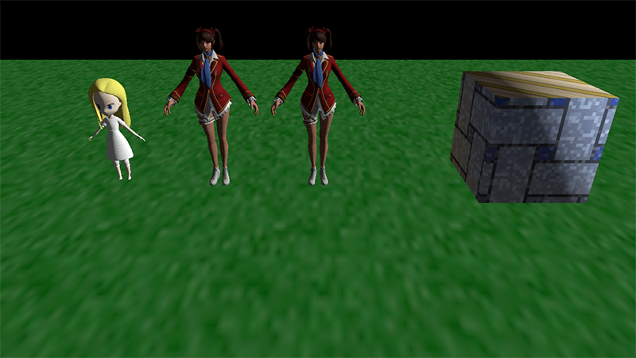

I'm following a Vulkan tutorial on vulkan-tutorial.com as a hobby project.

My plan is to make Dalbaragi Engine 2 using Vulkan.
I'd like to use Vulkan because I want to try real-time ray tracing, which OpenGL doesn't and won't support.

# How to build

CMake is the only supported build system.  
You need [LunarG SDK](https://www.lunarg.com/) installed.  

It only runs on Windows because I used win32api for file system.
But don't worry!
My next Vulkan project will support Windows, Linux, and Android.

# Relevant contents

Everything inside `./apps` is the relavant rendering engine code.
There are plenty of files.
Vulkan requires lots of codes.

Shader codes are in `./resouce/shader` folder.
You need LunarG SDK installed to compile glsl to Spear-v binaries yourself.
They are included in the repository though.

# What is presented?

Umm... nothing interesting at the moment.
I'm focusing only on Vulkan, which is rendering engine.
Game engine aspects like control, resource importing, scene management are not in my priority.

This simple scene took 3485 lines of codes already!
Anything else cannot be considered as viable goals at this rate.

And I remember my first OpenGL code was bad... this one must be the same case.
So I'm planning to implement the minimum in this project, until I get familiar with Vulkan enough to evenrually start to make a game engine with it.
